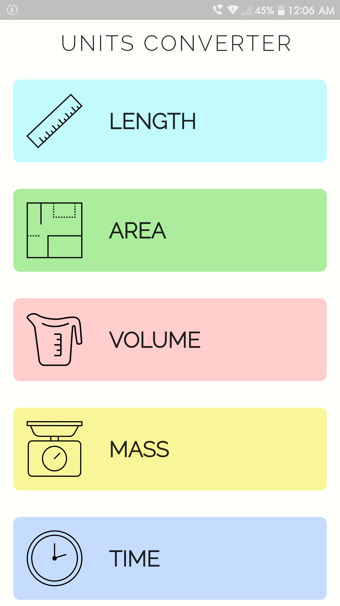
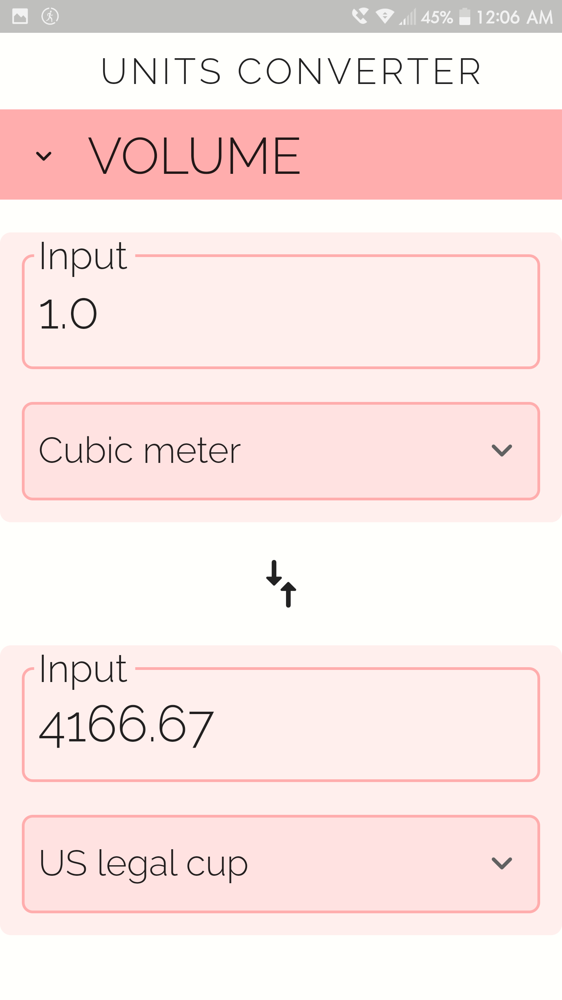

## This is a **Unit Converter** App made with Flutter

- It uses a json file for it's data
- Color palette for each unit category
- Responsive design for portrait and landscape modes
- No third party libraries were used
- There is seven categories to to choose and more than 5 units for each category to convert

 

## App Screenshots

| Main Page | Unit Page |
| :-: | :-: |
 | 

 

---
`Finished on 07-Mar-23`